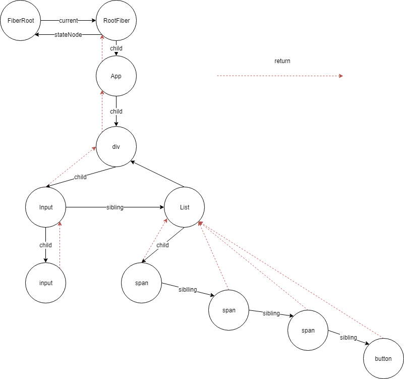

# learn-react-source-code

学习 react 源码  
react 源码

UI=fn(x)

Fiber

## 目录

- React API
  - createElement
    - ReactElement
      - $$typeof: REACT_ELEMENT_TYPE
    - Component
    - PureComponent
  - createRef & ref
    - stringref
    - function
    - React.createRef()
    - React.forwarRef()
  - createContext
    - childContextType
      - `getChildContext(){return {value: this.state.childContext}}`,`Parent.childContextTypes={value: PropTypes.string}`
      - `Child.contextTypes={value: PropTypes.string}`,`this.context.value`
    - createContext
      - `const {Provider, Consumer} = React.createContext('default')`
      - `<Provider value={this.state.newContext}></Provider>`
      - `<Consumer>{value => 
new Context {value}
}</Consumer>`
  - JSX => JS
  - ConcurrentMode
  - Component
  - Suspense
    - lazy
  - Hooks
- React 中的更新创建
  - ReactDOM.render || hydrate
    - 创建 ReactRoot
    - 创建 FiberRoot 和 RootFiber
    - 创建更新
  - setState
  - forceUpdate
  - Fiber
  - UpdateQueue
  - FiberRoot
  - Update
  - expirationTime
- Fiber Scheduler
  - scheduleWork
  - batchedUpdates
  - performWork
  - performUnitOfWork
  - requestWork
  - react scheduler
  - renderRoot
- 开始更新
  - beginWork 以及优化
  - 各类组件的更新过程
  - 调和子节点的过程
- 完成各个节点的更新
  - completeUnitOfWork
  - completeWork
  - unwindWork
  - 虚拟 DOM 对比
  - 错误捕获处理
  - 完成整棵树更新
- 提交更新
  - commitRoot 整体流程
  - 提交快照
  - 提交 DOM 更新
  - 提交所有声明周期
  - 开发时的帮助方法
  - 提交 DOM 插入
  - 提交 DOM 删除
- 各种功能的实现过程
  - context 的实现过程
  - ref 的实现过程
  - hydrate 的实现过程
  - React 的事件体系
- Suspense
  - 更新优先级的概念
  - Suspense 组件更新
  - retry 重新尝试渲染
  - 更新挂起的概念
  - timeout 处理
  - lazy 组件更新
- Hooks
  - 核心原理
  - useEffect
  - useState
  - useContext
  - 其它 Hooks API

在接触一个新事物之前最大的困难不是不理解而是不知道。

### 通读源码不是目的

- 外在
  - 提高开发能力
  - 解决问题能力
  - 提升自身价值
- 内在
  - 提升学习能力
  - 提升思考能力
  - 提升设计能力

### 什么是 FiberRoot

- 整个应用的起点
- 包含应用挂载的目标节点
- 记录整个应用更新过程的各种信息

### Fiber

- 每一个 ReactElement 对应一个 Fiber 对象
- 记录节点的各种状态
- 串联整个应用形成树结构
FiberRoot 和 RootFiber

#### fiber树结构

### Update & UpdateQueue

ReactDOM.render 过程当中还需要去创建的一个对象：Update

#### 什么是 Update

- 用于记录组件状态的该变
- 存放于 UpdateQueue（单向链表的数据结构）中
- 多个 Update 可以同时存在

### expirationTime

#### 不同的 expirationTime

种类：

- Sync 模式
- 异步模式
- 指定 context

### setState & forceUpdate

核心：

- 给节点的 Fiber 创建更行
- 更新的类型不同

### 总体流程概览

下一节：04-01
